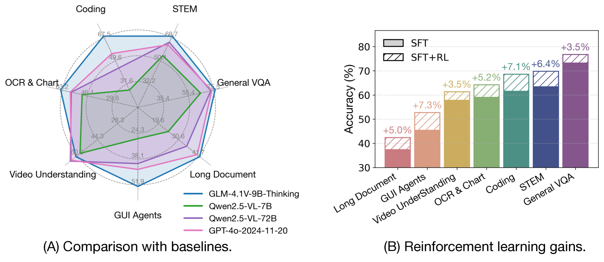
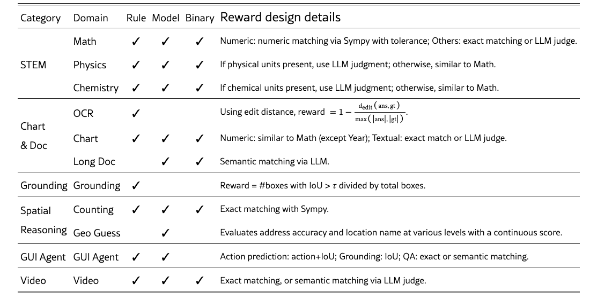
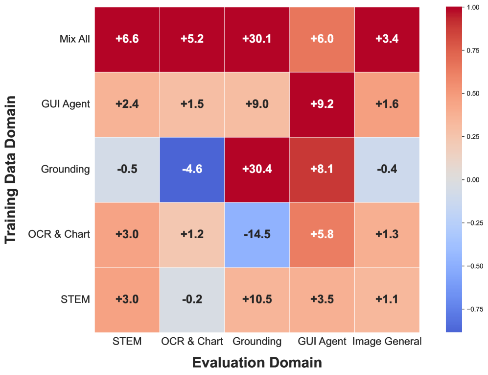

> 针对RL的跨任务泛化问题做了消融实验，且多任务的设置以及各自对应的奖励系统介绍的比较详细，可参考
>
> 训练中的强制思考设置 👍🏻
>
> 列举了一些稳定训练的因素 👍🏻

# 引言

- GLM对标MimoVL和MiniMax(https://arxiv.org/html/2505.18129)，着力于 **全领域** 的推理能力。
- 关键发现
  - RL训练的好，相比于SFT，会带来跨领域的 **OOD收益**
  - 动态选择最具信息量的rollout（即技术报告里提到的 **课程学习**，我理解和DAPO的整体思想比较像，只是在候选数据上略有不同）
  - 跨领域(或者说跨技能)RL，某一能力对应的奖励信号存在的微小缺陷，都可能导致整个训练崩溃。

# 概述与架构

- Vision tower → **AIMv2-Huge**
  - 和qwen一样，视频输入的时序采样系为2，图片则复制一份
  - 原生分辨率&宽高比
- Language tower → **GLM**

# 预训练+监督训练

提供了pt、sft数据的处理流程， 如有需要，可参考技术报告，不展开记录。

<table border="1" cellpadding="5" cellspacing="0">
<tr>
<th>知识密集型语料</th>
<th>PT</th>
<th>监督微调数据</th>
<th>SFT</th>
</tr>
<tr>
<td>1. 基于世界知识的图文对 2. 交错图文from网络&学术资料 3. OCR 4. grounding 5. 教学视频 6. 指令调优50M</td>
<td>两阶段预训练 gbs=1536 seq_len从8192→32768</td>
<td>1. 可验证任务 2. 开放式视觉问答</td>
<td>🎈学习风格，并非知识注入 1. max_len=32768，gbs=32 </td>
</tr>
</table>

# GRPO

## **数据准备⭐️**

1. 任务明确，每个子域定义一组可验证任务，比如对视频做时间定位
2. 数据管理，比如将单选转换为填空，消除随机猜测在RL中的干扰
3. 质量验证和离线难度分级，利用现有的或先前的RL模型运行pass@k，与人类难度标签相结合，实现细粒度难度分级
4. 初步RL实验：在每个子域中进行初步的实验，确认数据质量和模型性能提升潜力

## 奖励系统

1. 格式：`<think>......</think><answer>......<|begin_of_box|>{}<|end_of_box|></answer>`
2. 风格：重复&中英文混杂&answer部分的指令合规性和流畅性
3. 准确性：ruled based

## 课程学习

-  **⭐️**数据配比：由于是多领域RL，所以首先在每个子领域运行试点实验，评估其训练难度、性能提升潜力和相应数据集中所需的训练 token 数量。
- 离线+在线filter：离线将数据划分难度等级，在线则是对每个生成的rollout，记录pass@k，并映射到相应的难度等级。
- **训练设置**

  - 推荐更大的bs，以获得长期的性能提升
  -  **⭐️**强制回答：思考长到被截断，通常会分配零奖励。但是冗长的推理不一定错误，尤其对于难题，思考路径可能是完全有效的。硬截断不仅浪费了rollout预算，还向训练中注入了噪声。通过插入`</think><answer>`来强制截断，提示模型给出最终答案。这种方式也有助于测试时动态控制思考预算。
  - 丢弃 KL 损失：与LLM相比，VLM在RL中 KL 散度的增加通常更快。显式的抑制这种增加，会损害模型性能。
  - Clip-higher：类似于Dapo，提高重要性采样的上限裁剪边界也被证明有助于提升离线策略性能并防止过度熵坍缩。
- **经验分享**

  - RL 的峰值性能并不完全与冷启动 SFT 模型的性能相关，主要还是看“内在潜力”。
  -  **⭐️**RL中的领域干扰不如SFT中明显，在 RL 训练领域正交的欠训练或未训练领域中，性能可以保持得相当好。此外，经常观察到跨领域泛化现象。
- **稳定训练因素**

  - 冷启动数据质量很重要，强烈建议要将质量阈值设定的较高
  - 移除entropy loss，因为发现会导致乱码输出
  - rollout时使用top_p=1，消除后期倾向于出现的乱码输出
  - per-sample和per-token的loss计算没有观察到奖励上的差异，但是per-sample的训练相对稳定

# 讨论——跨领域泛化
- 单领域实验的样本数据量和mix all一致 

